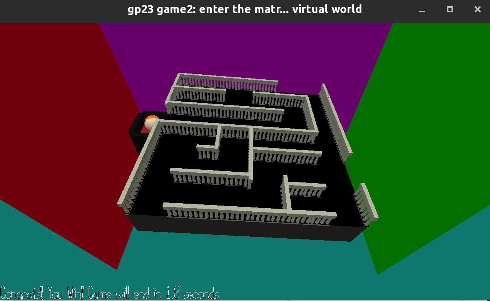

# Control the Ball

Author: Yuan Meng

Design: The idea is totally from a shrine puzzle in Lengend of Zelda: Breath of the Wild where you need to control a ball to the final destination by rotating the plane(using the gravity).

Bugs: It is hard to tell the actual rotation angles of the plane as there is no good reference object showing the world X,Y,Z axis. So you might get lost when rotating the plane. I tried to add some walls of different color but it doesn't seem to work well. Also, The game has bugs in the physics system. If the plane is moving too fase, the ball will go through the wall, and the wall is considered to absorb all the energy from the ball(which means the ball's speed will reduce to zero when it hits a wall, it will not go to the reverse direction due to reaction force). The rotation of the ball also seems not very physics based.

Screen Shot:

How To Play:

WS to rotate along X axis, AD to rotate along y axis, QE to rotate along z axis. Control the ball to the yellow platform.

This game was built with [NEST](NEST.md).
